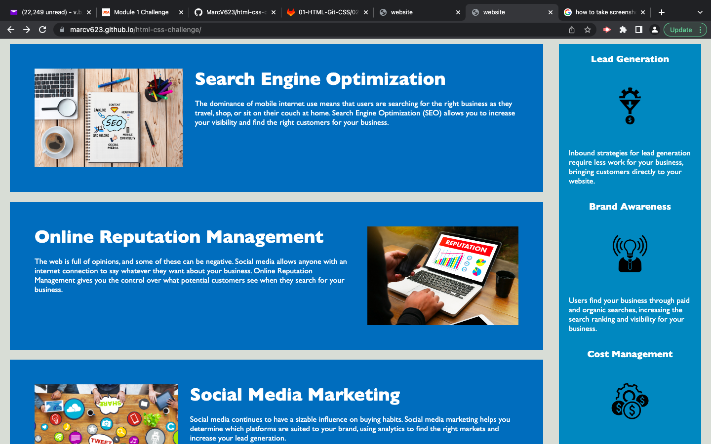
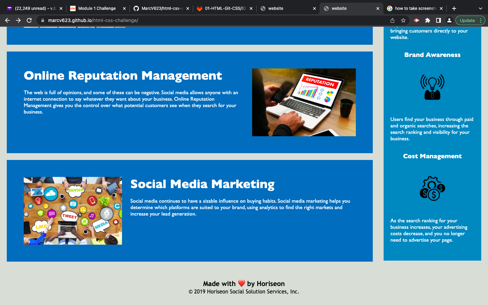

## Overview

This repository contains a sample internet marketing website. The purpose of this challenge is to teach students about the basics of HTML & CSS.

A live verion of the application can be found [here](https://marcv623.github.io/html-css-challenge/). The application should look something like this:

 
 
 
 